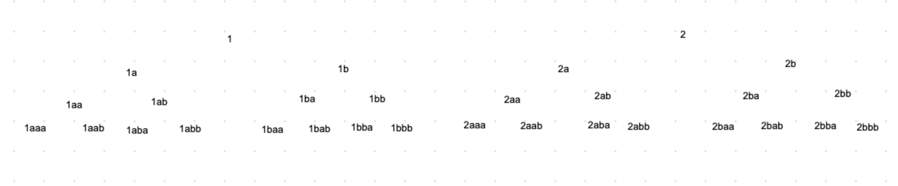

# README

Navigator is a tool to streamline the writing of a choices driven narrative.

It helps you easily make the components of such a story, then collects them in a project that you can either export as an NDS or play in browser. 

## Domain:

Prompt

    - belongs_to :prompt
    - has_many :choices

Choice

    - belongs_to :prompt
    - has_one :text
    - has_one :prompt, through: :text

Text

    - belongs_to :choice
    - has_one :prompt

# How to start writing a PaP adventure 
This was an incredibly helpful article and inspired a lot of the ideas in here: https://hobbylark.com/writing/How-To-Write-A-Pick-A-Path-Story

To start with, let's try writing a story with only two choices at the jump point. 
 

My god. Just 2 choices leads to 16 possible endings if we go only 4 layers deep, and that's not even considering the possible endings in between.

That, my friend, is a lot of writing.

But that's not to say that every single one of those 16 endings have to be used - that might just be the BEST possible ending. Perhaps the main character dies and that line of choices ends?
(this is also what the author of that blog post calls a 'cop out', which is fair).
Lets say then that only 3 of those are scenarios where the man escapes with his life. The rest of the sequences result in his death. 

